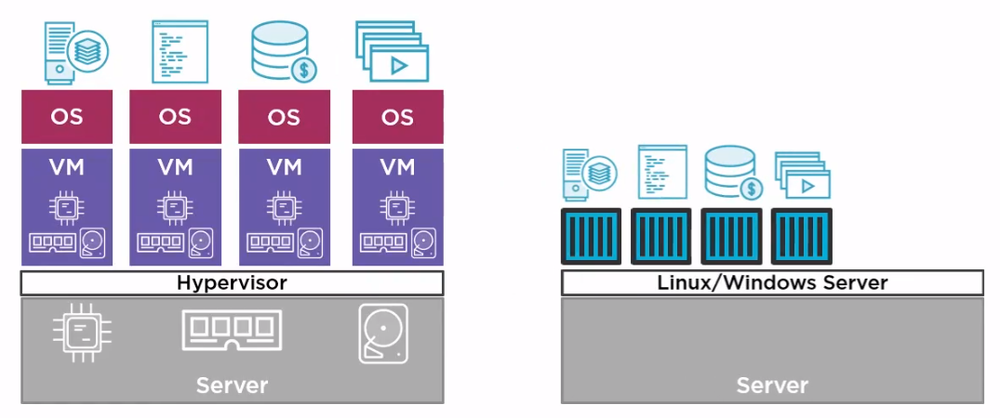

# Docker and Kubernetes: The Big Picture

A Pluralsight course

[@nigelpoulton](twitter.com/nigelpoulton)
[www.nigelpoulton.com](www.nigelpoulton.com)

## Goal

* Get up to speed
* Give Directions
* Cover Fundamentals

## Containers Primer

### The bad old days

Applications running on dedicated servers.
One lonely application for one lonely server.
Servers are overscaled to avoid bottlenecks. No elasticity.

### Hello VMware
 
Reduced server idleness by running multiple VMs in a single physical server.

**Downsides:**

* Need multiple installations of the same softwares, multiple OS for each VM.
* Shared physical resources (RAM, CPU, storage) are physically 'locked' to each VM. No easy flexibility.

Potential OS overheads:

* License costs
* Admin
  * Patching
  * Updates
  * AntiVirus
  * More...

### Containers

* One OS per server. Apps run in a 'container'.
* Remove all the OS overheads.

## Docker

There is the company Docker (Docker, Inc.) and the Docker project, they are different.
**Docker, Inc**. is a company from the Bay Area, that create Docker (the project). 

**Docker: The technology**
"Make containers easy"

* Open source
* Lives on GitHub
* Community Edition (CE)
  * Open source
  * Lots of contributors
  * Quick release cycle
* Enterprise Edition (EE)
  * Slower release cycle
  * Additional features
  * Official support

## Kubernetes

Come from Google and now it's Open Source.

Available on all good cloud platforms
On-premises

### The short and skinny

While docker concerns more about "low-level" tasks like start, stop and deleting a container. Kubernetes is aimed at "higher-level" tasks like **scheduling, scaling, healing, updating.**

## Thriving in a Container World

## Suitable Workloads

## Enterprise & Production Readiness

## A Word on Orchestration

## What Next?
