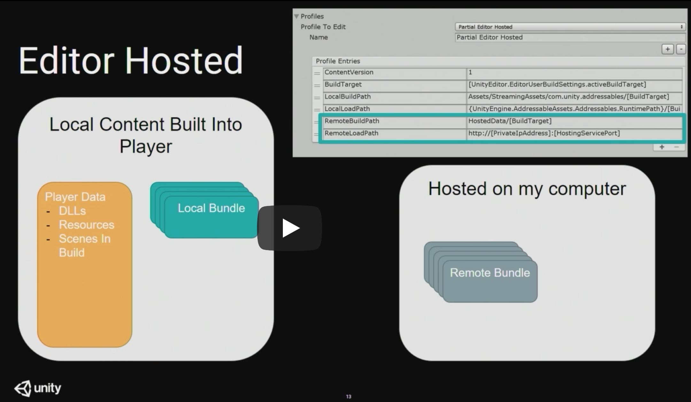
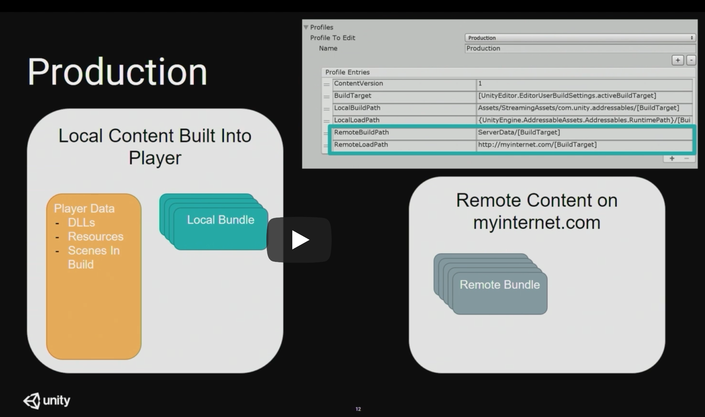
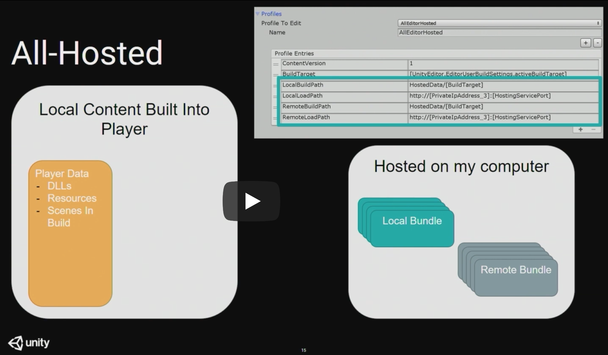
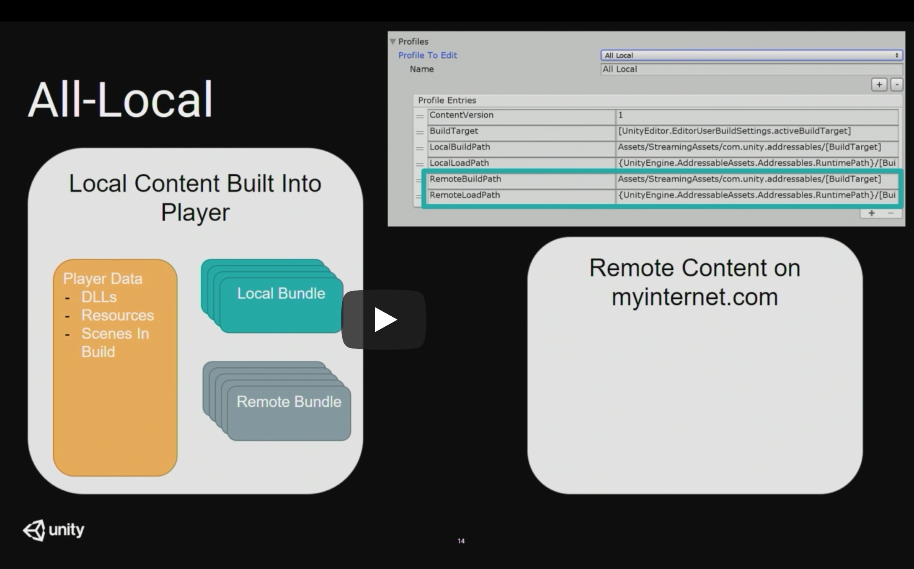
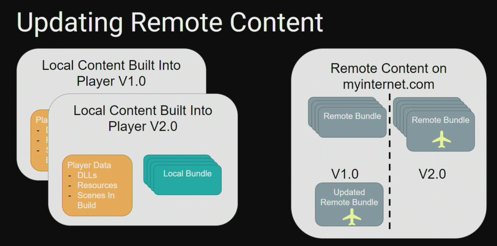
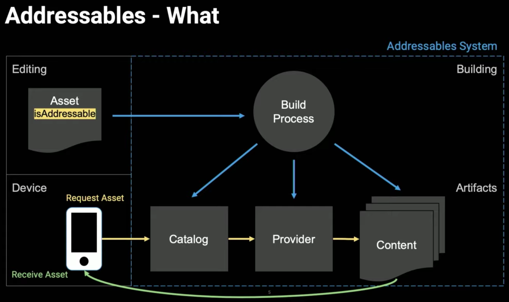
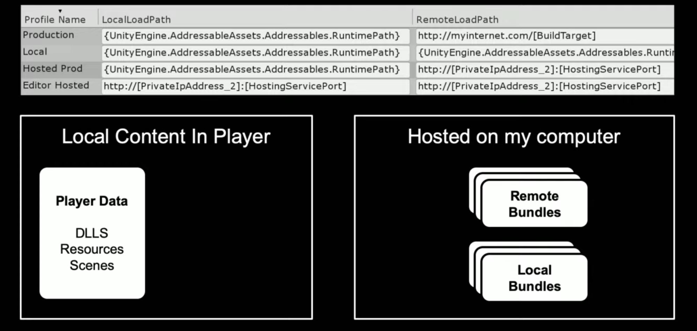

# Addressable

* [Unity Addressable documentation](https://docs.unity3d.com/Packages/com.unity.addressables@1.6/manual/index.html)
* [Addressable Forum](forum.unity.com/forums/addressables.156/)

  ---
* [Talk from Unite LA 2018](https://www.youtube.com/watch?v=U8-yh5nC1Mg) - This is from early version, still a good intro to the topic.
* [Talk from Unite Copenhagen 2019](https://www.youtube.com/watch?v=THs7h-wXHBg)
  **Addressables for Live Content Management**
  Bill Ramsour - Unity Live Content Team
  * [Slides](https://www.slideshare.net/unity3d/addressables-for-live-content-management)

The Addressable Asset system provides an easy way to load assets by “address”. It handles asset management overhead by simplifying content pack creation and deployment.

The Addressable Asset system uses asynchronous loading to support loading from any location with any collection of dependencies. Whether you use direct references, traditional asset bundles, or Resource folders for asset management, Addressable Assets provide a simpler way to make your game more dynamic.

## Notes from talk at Unite LA 2018

* Option: create a custom BuildScript for bundle encryption (14:00 on the [talk from LA 2018]((https://www.youtube.com/watch?v=U8-yh5nC1Mg)) above).
  * To decrypt a bundle, we can extend [Resource Manager](https://docs.unity3d.com/Packages/com.unity.resourcemanager@1.6/manual/index.html)
  * We can run consistency bundle checks or other rules (e.g. to avoid redundant dependency). Possible to run in batch mode in our CD/CI.

### Editor Hosting

* Provides an HTTP host run out of the editor
* Integrated with Addressables Profiles
* Custom hosts can provide any desired data

### Content Update Workflow

* How to handle updating content post-launch
  * “Prepare” and “Build” require a previous build
  * Prepare will detect changes in “Static” content

## Notes from talk at Unite Copenhagen 2019

* Addressables Overview
* Sprite Loading
  * Sub Objects
* Texture Quality Variation
  * Customizing Build
* Synchronous Addressables
  * Customizing Runtime
* What's Next

https://github.com/Unity-Technologies/Addressables-Sample

### Addressables - Why

* Building and deploying large games
  * Simplified asset building
  * Separation of concerns: *referencing* vs. *packing assets*.
* Managing assets at runtime
  * Loading dependency resolution
  * Runtime asset memory management
* Iterating during development
  * Flexibility in Play Mode
  * Local editor hosting

*"The Addressables system dramatically reduced the complexity of our asset pipeline and alowed us to focus more on adding the functionality that is unique to our game"*. - Jam City.

#### Addressables Groups

* Build time containers
* Hold Assets with Addresses
* Settings utilize Profile Variables

"Using Addressables on Empire of Sin has proven to be a great decision. It has given us much better control over asset loading and unloading, and provided greatly-improved tools for asset bundle management and dependency tracking." - Romero Games.

"Disruptor Beam has been abusing asset bundles since 2016 and have been working closely with Unity ever since on improving them. We are eager to adopt the addressable technology and take content deployment to the next level in our games and our Disruptor Engine technology." - Disruptor Beam

## What's Next

* Stability & bug fixes
  * UI Refresh in the fall
  * Exploring synchronous interfaces
* Addressables + DOTS in 2020.
* Content Delivery Service.

