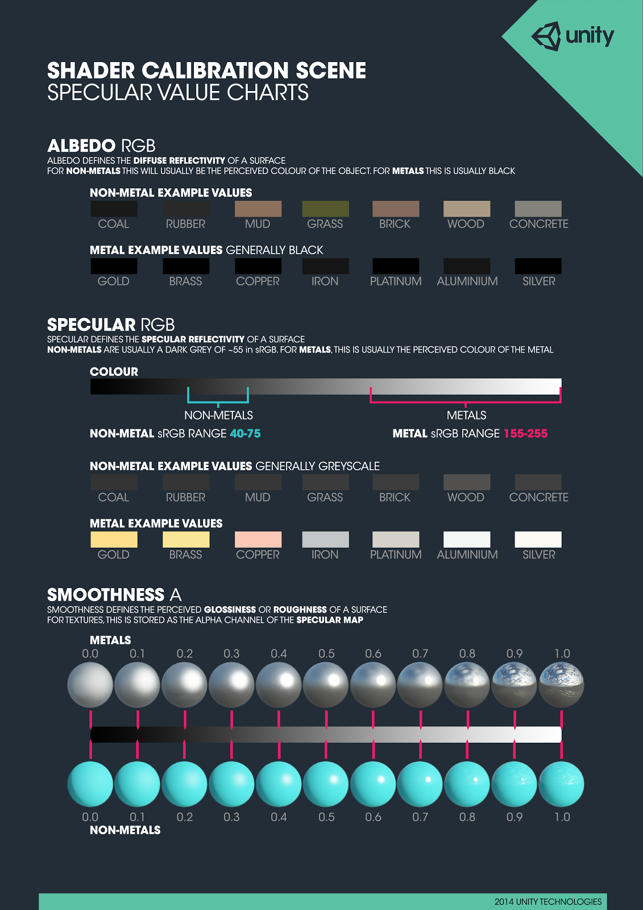
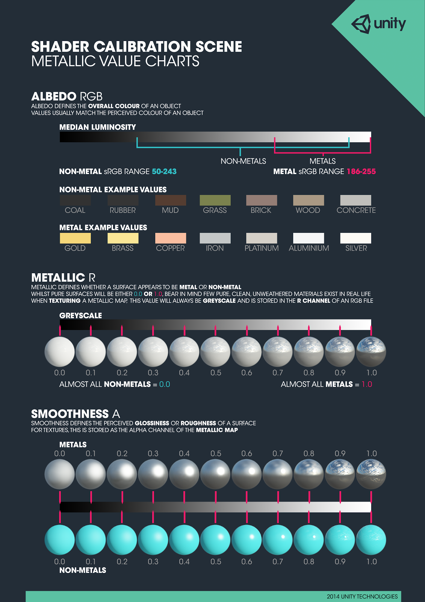

# unity Materials, Lighting, and Effects

https://www.linkedin.com/learning/cert-prep-unity-materials-lighting-and-effects

Unity Cert Prep course
by Alan Thorn

## Materials

For **PBR materials**, we should set `Color Space` to `Linear` (not `Gamma`, in _Player Settings_)
Consider that **Gamma** is older, and kind of _legacy_ and it's compatible with lots of old hardwares.

Albedo RGB

Medina Luminosity
* non-metal sRGB range 50~243
* metal sRGB range 186~255

When texturing a **Metallic** map, we will stored this value in the **R Channel** of an RGB file and the **smoothness** in the A (**alpha**) Channel.

## In-Depth materials

### Normal Maps

To create Normal Maps in Unity (a quick one at least)

* duplicate the original texture
* rename it to an appropriate name (using the word _normal_ is a good idea).
* Change the `Texture` Type_ property in the Inspector to `Normal Map`
* Check the `Create from Grayscale` boolean
* Adjust the `Bumpiness` and the `Filtering`
* Hit `Apply`

Then add this Normal map to your material, and tweak it to your tastings!

### Self illumination

Self-illuminated materials (Unlit) don't cast light into the scene, but they are illuminated. It's a subtle difference.

Shader/Unlit/Color
Shader/Unlit/Texture

### Transparency

Using the **Standard Shader** we can create a Glass-like Material using `RenderingMode/Transparent`

We can also achieve a transparency **without the specular** effect in our materials selecting the `RenderingMode/Fade`

Transparent is used for 'real world' objects, like Glass, and Fade is used for 'unreal' objects, like a ghost, or a hologram.

### Tiling and offsets

Tilling and Offset controls the UV-mapping of materials.

We can animate the tiling and offset of a material to simulate some movement, live a stream of lava.

## Lighting

Let's remove all lighting from the scene.
Even when removing all light objects from the scene, we can see an additional lighting that is 'built-in' in Unity.

Open **Lighting Settings** at `Windows / Lighting / Settings`

Remove the Skybox Material, we still have some light or occlusion.

In `Environment Lighting` the `Ambient Color` is not total black as default, set it to total black

### Light types

Let's add some lights to a dark scene.

`GameObject/Light/<types_of_lights>`

Activating `Realtime Lighting/ Realtime Global Illumination` (RGI) we can have nice bouncing lights over the scene.

### Global Illumination

Direct vs indirect illumination

It's a good practice to set objects as **static** (in the inspector) if they will never move during game time.

### Light baking (or light map)

This is a special technique to create great realistic lights, that will save all light information ahead of time into textures and blend them with the scene.

Uncheck `AutoGenerate` in Lightmapping settings.

We select our light source and we can change its `Mode`, from `Realtime` to `Baked`

### Area Lights

This is a BAKED-ONLY light. It's very heavy to calculate, but produces great results.

### Dynamic Lighting

`GameObject / Light / Light Probe Group`

`Edit Light Probes` button, then we can move every probe to some important positions in the scene, where we have key light features. The probe make light readings from the scene. We can add as many as we want.

Then in a `Mesh Renderer` component of a gameobject, we can select how it will interact with the Probes, going to `Mesh Renderer / Lighting / Light Probes`

Then Unity does its magic and uses some of the nearest probes to calculate dynamic lights for us, so this is an optimized way of calculating Dynamic Lights.

### Emissive Lighting

It takes any single one of our meshes or objects, use its entire surface as a light-casting source.

Create a new `Material`, select the Emission setting, and the set their Color, and Global Illumination mode (RealTime or Baked).
We also could put a **Texture map** into the Color property!

## Post Processing

### Introducing camera effects

We can adjust contrast, brightness, add blurring, and many more.

From the Asset Store we can add the **Post Processing Stack**

To get the most recent version of the PPP  
https://github.com/Unity-Technologies/PostProcessing

* Create -> Pos-Processing Profile*

With your Camera selected go to `Component -> Effects -> Post-Processing Behavior`, then add your PPP
